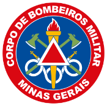

  
  

 

<h1 align="center">Hi, I'm Stephen Roque 👋</h1>
<h3 align="center">Cybersecurity (GRC | TPRM) | IT Infrastructure | Critical Systems</h3>

  <em>Military Firefighter at NTS - CBMMG</em>

 

### 🛡️ About Me

I am a **Cybersecurity and Risk Management** professional with a technical foundation in infrastructure and systems administration within mission-critical environments. Currently serving in the **Technology and Systems Core (NTS)** of the **Military Fire Department of Minas Gerais (CBMMG)**, I specialize in GRC and TPRM, leveraging the discipline of a 20-year career in the Brazilian Army, Navy, and Fire Department.

* 🎓 **Academic:** BSc in Computer Science at University of the People (Current GPA: **3.85**).
* 🔭 **Focus:** Governance, Risk, and Compliance (GRC), TPRM, and Infrastructure Security.
* 💼 **Experience:** Former Brazilian Army & Navy veteran with over a decade of disciplined service.
* 🌱 **Specializing:** Preparing for **CompTIA Security+** and deepening Risk Management Frameworks.

---

### 🛠️ Technical Arsenal

**Infrastructure, Security & Cloud**
 
     

 

**Development & AppSec Context**
 
    

 

**Tools & Management**
 
  

---

### 📜 Key Certifications & Honors
* **Ethical Hacker** | Cisco
* **Certified Fundamentals Cybersecurity** | Fortinet
* **GRC Specialist** | Hackers do Bem
* **Cybersecurity Specialist** | DIO
* **Intermediate English (B2+)** | UoPeople 🇺🇸
* **Spanish Proficiency (B2)** | Universidad de Salamanca 🇪🇸
* **Dean's List & President's List** | Academic Honors at UoPeople
* **Meritorious Note** | Professional Recognition for Search & Rescue (Brumadinho Mission)

---

  
Proudly serving at

  

 

  
  

